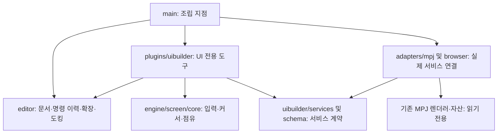

# MPJ Studio — UI Builder

원본 UI 레이아웃을 조합하는 개발용 편집기. 공통 편집기와 UI 전용 기능을 분리해 다른 엔진 편집 도구를 추가할 수 있도록 구성했다.

## 실행

```powershell
cd C:\dev\mpj\web\dev\uibuilder
npm run dev
```

주소: http://127.0.0.1:51812/dev/uibuilder/

기존 `web/node_modules`의 TypeScript, esbuild, Three.js를 읽어서 사용한다. 이 폴더 밖의 설정이나 패키지는 변경하지 않는다. 개발 서버는 빌드와 파일 감시만 실행하며 역공학 스캔을 실행하지 않는다. 포트를 바꾸려면 `npm run dev -- --port 51813`.

```powershell
npm test
npm run build
```

## 구조와 의존 방향



- `src/editor`: 도메인에 종속되지 않는 문서, 부모 관계 검증, 선택, undo/redo, 명령·패널 등록, 셸. UI 부품이나 MPJ를 import하지 않는다.
- `src/engine/screen/core.ts`: 외부 import가 없는 선택 런타임. 입력과 이벤트 호스트, 난수를 주입받는다. 플레이어 번호 순 처리, 비활성 항목 건너뛰기, 행/열 이동, wrap, 동시 점유를 담당한다.
- `src/plugins/uibuilder`: 부품·그룹·3D 영역 모델, 데이터 확장, 템플릿, 동작 연결, 배치, 미리보기 및 패널별 모듈. MPJ 어댑터의 구체 클래스를 import하지 않는다.
- `src/adapters/mpj`: 기존 `LayoutInst`/`Render2D` 사용, 아카이브/텍스처 이름 격리, 그래픽 경계 계산, 글꼴, 애니메이션 및 바인딩 적용. 게임 호출을 편집기 미리보기 로그로 연결한다.
- `src/adapters/browser`: 키보드와 표준 Gamepad 입력을 런타임 입력으로 변환한다.
- `server`: 원본 카탈로그 읽기, 정적 파일 제공, 내부 사용자 문서 저장을 각각 분리했다.

새 도구는 `Extension`으로 패널과 명령을 등록하고, `main.ts`에서 필요한 서비스를 조립한다. 문서의 `tool`, 엔티티의 `type`/`props`는 UI 이외 도메인을 수용한다. 코어를 공용 엔진 경로로 옮기는 작업은 현재 범위에 포함하지 않는다.

## 제공 기능

- 목록 카드에 실제 원본 렌더러로 생성한 썸네일을 표시한다. 레이아웃 미리보기는 원본 태그를 개별 재생할 수 있고, 39개 화면 구성도 별도로 미리 볼 수 있다. **갤러리 / 동시 미리보기**에서는 여러 썸네일을 격자로 보고 최대 4개를 함께 실행한다. 보이는 카드부터 한 개의 렌더러로 순차 생성한다.
- 상단 우측 실행 미리보기는 독립된 창에서 동작한다. 등장→입력→결정 애니메이션 완료→동작 실행→퇴장 순서를 적용하고, 포커스 이동 시 이전 버튼을 off→normal로 복원한다. B/Esc는 취소, 다인 확정 뒤 B/Esc는 해당 플레이어의 선택을 해제한다.
- 부품을 선택한 뒤 우측 **문구 편집**에서 템플릿 목록의 문구를 항목별로 바꾸거나, 새 버튼의 문구를 입력한다. **문구 적용** 후 캔버스와 실행 미리보기에 반영된다. **문구 추가 / 교체**는 텍스트 영역을 고정 문구로 연결한다.

- 9개 변환 명세에서 200개 고유 부품을 검색한다. 문서의 전체 원본 486개 목록을 별도로 표시한다. 기존 평면 렌더러가 처리할 수 없는 트리형 HUD 및 미변환 원본은 읽기 전용이다.
- 원본 부품을 캔버스로 끌어 넣고, 선택·다중 선택·이동·앞뒤 순서·좌표/크기/배율/회전·부모 그룹·정렬을 편집한다. 좌표는 1920×1080, 중앙 원점, Y 위쪽 양수다.
- 원본 pane 이름과 애니메이션 태그를 보존한다. 텍스트·이미지·표시 여부·색 바인딩, 초기 적용/지속 덮어쓰기, 애니메이션 충돌 후보를 제공한다.
- 데이터 JSON으로 목록/격자를 만들고 필터·정렬·간격·행/열·활성/소유자 정책을 설정한다. 데이터 항목은 최대 200개로 제한한다.
- 공용 6개, 캐릭터 5개, 방 목록 3개, 온라인·미니게임·항구·광장의 원본 조합 25개로 총 39개 구성을 제공한다. 템플릿은 새 편집 화면으로 열며 undo로 이전 화면을 복원한다. 전용 화면 데이터가 없는 구성은 편집을 시작하는 부품 조합이다.
- 미리보기에서 방향키/Enter/Esc와 표준 패드 1–4 입력을 받는다. 반복 입력 지연/간격, wrap, 다중 커서, 랜덤 선택, 결정/취소 동작을 설정한다.
- 동작의 sound/vibrate/Work/call/return은 서비스 계약을 통해 연결한다. 미리보기의 Work/call/return/vibrate는 로그이며, sound는 확인 가능한 기존 소리 파일을 재생한다.

## 저장과 게임 연결

저장은 **이 폴더 내부 `assets/custom/<화면 ID>.json`**에만 한다. 덮어쓸 때 이전 내용을 `.bak`으로 남긴다. UI에서 저장된 문서를 열거나 JSON을 가져오고 내보낼 수 있다. 파일 이름은 영문·숫자·밑줄·하이픈으로 최대 64자다. 서버는 localhost에만 바인딩하며 저장 경로 이탈을 차단한다.

`party-builder-demo.json`은 좌표 편집과 저장을 확인한 예제다. 기본 화면은 모드 메뉴 템플릿으로 시작한다. 실제 게임이 이 문서를 읽는 로더와 실제 Work/라우팅 서비스는 연결하지 않았다. 캐릭터 선택 미리보기의 3D 카드는 기존 web 화면이 직접 렌더링한다. 임의의 3D 영역에는 서비스 ID와 사각형만 저장한다.

원본 화면의 픽셀·타이밍·행동 동등성은 검증하지 않았다. 템플릿은 원본 부품을 이용한 사용자 화면의 시작 구성이다. 입력 반복 기본 24/6프레임은 조정 가능한 미리보기 정책이며 네이티브 동작을 확정한 값이 아니다. 실제 패드와 원본 대조 검증은 별도로 필요하다.

## 검증

`npm test`는 커서 이동·wrap·점유 순서, 문서 검증과 명령 복원, 그룹 변환과 데이터 확장, 확장 ID 충돌을 검사한다. 서버 카탈로그 200/486, 저장 왕복과 백업, 경로 제한, 공통 코어의 import 경계도 검사한다. 테스트 출력은 내부 `.cache/tests`에 저장한다.

추가 검증: 포커스 복원, 공간에 따른 좌우 이동, 결정 프레임 대기와 단일 실행, 취소 퇴장, 다인 선택 해제, 문구 바인딩 교체, 짧은 키 입력과 키보드 플레이어 지정, 창 조각이 문구를 가리지 않는 그리기 순서. 39개 템플릿의 모든 바인딩 경로도 원본 명세와 대조한다. `preview-text-demo.json`은 템플릿 문구 수정과 새 버튼 문구 입력을 저장한 예제다.

브라우저에서 원본 렌더링, 좌표 0→300 변경, 저장, undo/redo, 방향키 선택 및 결정의 Work/call 로그를 확인했다. TypeScript 엄격 검사와 esbuild 빌드도 통과했다.

읽은 기준 문서: `web/docs/engine/common_roadmap.md` §8, `web/docs/engine/ui_parts_catalog.md`, `web/docs/shell/ui2d_alignment.md`, `web/DESIGN.md` §10.

## 기존 web 화면 재사용

편집기·갤러리·저장과 화면 동작은 서비스 계약으로 분리된다. UI 플러그인은 `nativePreview.ts`의 `NativeSession`만 알고, `main.ts`가 MPJ 어댑터를 주입한다. `templates/`는 공용·캐릭터·온라인·화면 조합 레시피로 나눈다.

| 어댑터 | 직접 import하는 기존 web 기능 | 미리보기 범위 |
| --- | --- | --- |
| `nativeCharSelect.ts` | `createCharSelect` | 레이아웃, 3D 카드, 22명·랜덤·잠금, 점유, 결정 해제, 최종 OK, 퇴장 |
| `nativeRoomList.ts` | `SessionListView`, `OnlineView`, `MgmView` | 편집 가능한 샘플 방 데이터, 5행 창, 전체 목록 커서, 4·8인 탭, 얼굴·자물쇠, 결정·취소 |
| `nativeOnlinePanel.ts` | `NetMenuPanel`, `RoomTypePanel`, `OpponentPanel`, `OnlineView` | 원본 버튼·아이콘·문구·애니메이션·입력 규칙 |
| `nativeWindow.ts` | `MgmWindow`, `MenuGrid`, `WindowLife`, `MgmView` | 나머지 변환 화면 조합과 부품 메뉴; 모드의 전체 게임 흐름·데이터는 별도 |

캐릭터 마우스 선택도 `CharSelectState`로 계산한 방향 입력을 기존 화면에 전달한다. private 메서드 호출이나 커서 직접 덮어쓰기는 하지 않는다. 각 비교 화면은 입력 소스를 소유하며, 키보드·패드는 현재 포커스가 들어 있는 화면에만 전달된다. 방 목록 샘플은 `datasets.roomScreen[0].rooms`에서 편집한다. 실제 온라인 서버에는 연결하지 않는다.

`npm test`의 16개 테스트에 기존 캐릭터 상태를 이용한 마우스 이동·점유·결정 해제와 기존 방 목록의 5행 스크롤·이름·얼굴·자물쇠·탭·반복 경계 검증이 포함된다. 브라우저에서는 두 화면 동시 실행, 입력 격리, 캐릭터 4명 결정→최종 OK→퇴장, 방 7번째 행 스크롤, 8인 방 결정, 온라인 메뉴의 다른 버튼 클릭 결정을 확인했다.
